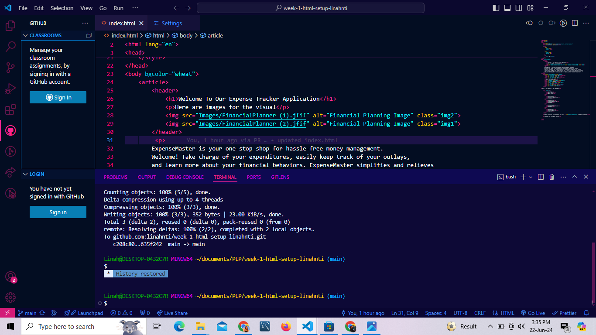

# SE-Assignment-5
Installation and Navigation of Visual Studio Code (VS Code)
 Instructions:
Answer the following questions based on your understanding of the installation and navigation of Visual Studio Code (VS Code). Provide detailed explanations and examples where appropriate.

 Questions:

1. Installation of VS Code:
   - Describe the steps to download and install Visual Studio Code on Windows 11 operating system. Include any prerequisites that might be needed.

   Prerequisites needed for me:
   a. ARM64 or x64 processor
   b. Minimum of 4 GB of RAM.
   c. Minimum 2 vCPU and 8 GB RAM
   d. Hard disk space: Minimum of 850 MB up to 210 GB of available space
   e. Video card that supports a minimum display resolution of WXGA (1366 by 768)
   Steps:
 Visited the Visual Studio Code website  (https://code.visualstudio.com/). Clicked on the download button for Windows.
Run the Installer: Located the downloaded .exe file and double-click to run the installer.
Followed the installation prompts. I used the default options for the installation path and other settings.
Launched VS Code: Once installed, I launched VS Code by double-clicking the shortcut on my desktop.

.png>)

2. First-time Setup:
   - After installing VS Code, what initial configurations and settings should be adjusted for an optimal coding environment? Mention any important settings or extensions.

Settings:
   Theme: Chose a theme that is comfortable for my eyes i.e Dark(Visual Studio Code). You can do this by going to File > Preferences > Color Theme or download a theme from the extensions.

   .png>)
   Font: Set a preferred font and size in File > Preferences > Settings by searching for Editor: Font Family and Editor: Font Size
   .png>)

   Auto Save: Configure auto-save by searching for Files: Auto Save in the settings.

Extensions:
   GitLens: Supercharges the Git capabilities built into Visual Studio Code. It helps you to visualize code authorship at a glance via Git blame annotations and code lens
   .png>)
   Live Server: Launches a development local Server with live reload feature for static & dynamic pages.
   .png>)
   Python: The official extension by Microsoft that provides enhanced support for Python, including features such as IntelliSense, linting, debugging, code navigation, code formatting, Jupyter notebook support, refactoring, and more.
   .png>)
   Open in browser : allows a person to open the current file in defaukt browser or application.
   .png>)
   

3. User Interface Overview:
   - Explain the main components of the VS Code user interface. Identify and describe the purpose of the Activity Bar, Side Bar, Editor Group, and Status Bar.

   a. Activity Bar :  Located on the far left-hand side. Lets you switch between views and gives you additional context-specific indicators, like the number of outgoing changes when Git is enabled. You can change the position of the Activity Bar.
   
   
    Explorer: The folder icon that opens the file explorer to browse and manage your project's files and folders.
   Search: The magnifying glass icon that allows you to search across files in your project.
   Source Control: The branch icon that integrates with Git and other version control systems.
   Run and Debug: The play icon that helps you run and debug your code.
   Extensions: The square icon that allows you to browse and install extensions to add new features to VS Code.
   Additional Views: Other views can be added through extensions, such as Github, gitlens and liveshare.

   b. Side bar: The Side Bar is adjacent to the Activity Bar and displays the content related to the selected activity.
 
Explorer: Shows the file and folder structure of the workspace.

Search: Displays search results and options.

Source Control: Shows changes, commits, branches, and other Git-related actions.

Run and Debug: Provides controls and views for running and debugging applications, such as breakpoints and call stacks.

Extensions: Lists installed extensions and provides a marketplace to find and install new ones.

c. Editor group: The Editor Group is the central area where files are opened and edited. It can contain multiple editor panes, allowing you to view and work on multiple files simultaneously.

Tabs: Each open file appears as a tab at the top of the Editor Group. You can switch between files by clicking on the tabs.
Split Editors: You can split the Editor Group vertically or horizontally to view and edit multiple files side by side.
Content: The main area where you write and edit your code or documents.

d. Status bar : The Status Bar is located at the bottom of the VS Code window. It provides information about the current workspace, open files, and their status.

Information: Displays information such as the current line and column number, the language mode of the file, and the Git branch.
Notifications: Shows notifications and status messages related to various VS Code operations, such as build status or extension updates.
Settings and Actions: Includes quick access to settings, like changing the encoding or line endings of the current file, and actions like syncing settings or switching the workspace.

4. Command Palette:
   - What is the Command Palette in VS Code, and how can it be accessed? Provide examples of common tasks that can be performed using the Command Palette.

Command palette is an important tool in vs code and it is opened by the key combination Ctrl+Shift+P or using Menu Option: Click on View in the top menu, then select Command Palette. From here, you have access to all functionality within VS Code, including keyboard shortcuts for the most common operations.

Examples of Tasks Using the Command Palette
Running Tasks: You can run tasks defined in your workspace or in task runner extensions like npm scripts or gulp tasks. For example, typing "Run Task" will list all available tasks.

Opening Files: Quickly open any file within your project by typing its name. This is useful for navigating large projects without using the file explorer.

Changing Settings: Instead of navigating through settings menus, you can modify settings directly by typing "Preferences: Open Settings" or "Preferences: Open Settings (JSON)".

Installing Extensions: Install new extensions from the VS Code Marketplace by typing "Extensions: Install Extensions".

Git Operations: Perform Git operations such as committing changes, pulling, pushing, or resolving conflicts using commands like "Git: Commit", "Git: Pull", "Git: Push", "Git: Sync", "Git: Pull", etc.

Refactoring: Access various refactoring tools like renaming symbols, extracting code into functions or variables, and more.

Debugging: Start, stop, and manage debugging sessions through commands like "Debug: Start Debugging", "Debug: Stop Debugging", "Debug: Restart".

Terminal Operations: Access terminal commands such as creating new terminals, running shell commands, and switching between them.

Tasks and Build: Run build tasks configured in your project, such as compiling TypeScript, running linters, or executing build scripts.

Version Control: Manage version control operations including staging changes, comparing changes, and navigating through diffs.

5. Extensions in VS Code:
   - Discuss the role of extensions in VS Code. How can users find, install, and manage extensions? Provide examples of essential extensions for web development.

Extensions allow users to customize their development environment, integrate with external tools and services, and enhance productivity in various programming languages and development workflows.

Finding and installing extensions:
Extensions Marketplace: The primary method is through the VS Code Marketplace accessible directly within the editor or via the web. Users can search for extensions by name, category (like "Web Development" or "Python"), or functionality.

Command Palette: the Command Palette (Ctrl+Shift+P and then typing "Extensions: Install Extensions") allows users to search for and install extensions directly from within VS Code.

VS Code Website: Users can browse and discover extensions on the Visual Studio Code website, where they can read reviews, check ratings, and get more information before installing.

Managing extensions:
Enable/Disable: Extensions can be enabled or disabled based on your current needs. This is useful for managing resource consumption and minimizing clutter in the editor.

Update: Extensions can be updated automatically or manually to get the latest features, bug fixes, and compatibility updates.

Extensions for web development:
Live Server: Launches a local development server with live reload feature for static and dynamic pages. It's great for front-end development and testing.

ESLint or Prettier: Helps enforce code quality and formatting standards in JavaScript, TypeScript, and other languages.

GitLens: Enhances the Git capabilities within VS Code, providing detailed insights into repository history, line-by-line blame annotations, and more.

HTML CSS Support: Provides autocompletion, syntax highlighting, and other helpful features for HTML and CSS development.

JavaScript (ES6) code snippets: Offers a collection of snippets for ES6 JavaScript syntax, making coding faster and more efficient.

Path Intellisense: Autocompletes filenames in your code, making it easier to reference files and assets.

6. Integrated Terminal:
   - Describe how to open and use the integrated terminal in VS Code. What are the advantages of using the integrated terminal compared to an external terminal?

   Using Menu:
Click on View in the top menu.
Select Terminal from the dropdown menu.
Choose New Terminal to open a new instance of the integrated terminal.

Using Shortcut:
Press Ctrl+` (Backtick) on Windows.

Advantages of intergrated terminal: 
Seamless Integration: The integrated terminal is part of the VS Code interface, allowing for a seamless workflow where you can edit code and execute commands in the same window without switching contexts.

Direct Access: Quickly access project-specific commands and tools without leaving the editor. This saves time and effort in navigating between applications.

Workspace Awareness: The integrated terminal opens in the context of the current workspace or project, making it easier to manage project-specific dependencies and configurations.

Shared Context: The terminal shares the same environment (e.g., PATH variables) as VS Code, ensuring consistency in behavior and results between editor actions and terminal commands.

Task Integration: VS Code's tasks and build system can directly interact with the integrated terminal, allowing for seamless execution of build tasks and scripts.

Enhanced Productivity: Features like syntax highlighting, command history navigation (Up and Down arrows), and the ability to open files directly from the terminal output (using code .) enhance productivity.

Extension Support: Extensions can enhance the integrated terminal's functionality with features like debugging, language-specific enhancements, and more.

7. File and Folder Management:
   - Explain how to create, open, and manage files and folders in VS Code. How can users navigate between different files and directories efficiently?

Creating a New File:

Click on the Explorer icon in the Activity Bar on the side of the VS Code window (or use Ctrl+Shift+E on Windows).
Right-click on the folder where you want to create the file.
Select New File and then type the desired filename.
Creating a New Folder:

Similarly, right-click on the parent directory in the Explorer.
Choose New Folder and enter the folder name.
Using Command Palette:

Open the Command Palette (Ctrl+Shift+P).
Type Files: New File to create a new file in the current directory.
Type Files: New Folder to create a new folder in the current directory.

Opening Using Explorer:

Double-click on a file to open it in the editor.
Similarly, double-click on a folder to expand it and view its contents.
Using Command Palette:

Open the Command Palette (Ctrl+Shift+P).
Type File: Open File to navigate to and open a specific file.
Type File: Open Folder to open an entire folder as a workspace in VS Code.
Using Keyboard Shortcuts:

Press Ctrl+P (Windows) to open the Quick Open dialogue.
Type the filename or path to quickly navigate and open files.

Managing Files and Folders
Renaming and Moving:

Right-click on a file or folder in the Explorer and choose Rename to change its name.
Drag and drop files or folders within the Explorer to rearrange or move them.
You can also use the Files: Move File and Files: Copy File commands from the Command Palette to move or copy files between directories.
Deleting:

Right-click on a file or folder and select Delete to remove it.
Deleted files are moved to the system's Recycle Bin (Windows), unless permanently deleted.
Managing Extensions:

Install the extension "File Utils" to easily create, rename, move, copy, and delete files and folders directly from the Explorer context menu.
Navigating Between Files and Directories Efficiently
Using Tabs:

Open multiple files simultaneously in VS Code tabs (Ctrl+Tab to switch between them).
Right-click on a file tab to see options for closing tabs or grouping them into tab groups.
Navigating Through Files:

Use Ctrl+P (Windows) to quickly open files by typing part of their name.
Ctrl+Tab (Windows) switches between recently opened files.
Navigating Through Directories:

Use the Explorer view to navigate through directories visually.
Type Ctrl+Shift+E (Windows) to focus on the Explorer view if it's hidden.
Use Alt+Left Arrow and Alt+Right Arrow (Windows) to navigate backward and forward through the directory history.
Using Symbols/Outline:

Ctrl+Shift+O (Windows) opens a quick outline of the current file, allowing you to navigate to specific functions, classes, or sections quickly.

8. Settings and Preferences:
   - Where can users find and customize settings in VS Code? Provide examples of how to change the theme, font size, and keybindings.

Setting interrface:
Open VS Code.
Click on the gear icon (⚙️) in the bottom left corner of the Activity Bar to open the Settings pane.
Alternatively, press Ctrl+, (Windows) to open the Settings directly.

Examples of Common Customizations
Changing the Theme using the Settings UI:

Open the Settings.
Search for "Color Theme" in the search bar.
Click on the dropdown under "Color Theme" and choose a theme from the list (e.g., "Dark+ (default dark)")

Changing Font Size using the Settings UI:

Open the Settings.
Search for "Editor: Font Size".
Adjust the value in the "Editor: Font Size" input box to change the font size (e.g., 14 for 14px).
Using Settings JSON:

Usig Settings JSON:
Open settings.json.
Add or modify the "editor.fontSize" property.

Changing Keybindings
Using the Settings UI:
Open the Settings.
Search for "Keyboard Shortcuts".
Click on "Open Keyboard Shortcuts (JSON)" to open the keybindings.json file.
Here you can add or modify keybindings as per your preference.

9. Debugging in VS Code:
   - Outline the steps to set up and start debugging a simple program in VS Code. What are some key debugging features available in VS Code?

1. **Open Your Project**:
   Open the folder containing your project files in VS Code.

2. **Create a Launch Configuration**:
   - Click on the Debug icon in the Activity Bar (looks like a bug).
   - Click the gear icon (⚙️) to create a `launch.json` configuration file.
   - Choose the environment you want to debug (e.g., Node.js, Python, etc.).

3. **Configure Launch Settings**:
   - In `launch.json`, configure the necessary settings:
     - `"program"`: Path to the entry point of your application (e.g., `app.js` for Node.js).
     - Other settings specific to your environment (e.g., `"args"` for command-line arguments).

4. **Set Breakpoints**:
   - Open the file you want to debug.
   - Click in the gutter next to the line number to set a breakpoint (a red dot will appear).

5. **Start Debugging**:
   - Press F5 or click the green play button in the top-left corner.
   - VS Code will launch your program in debug mode.
   - It will stop at breakpoints or when an exception occurs.

6. **Debugging Features**:
   - **Step Over (F10)**: Execute the current line and move to the next line.
   - **Step Into (F11)**: If the current line calls a function, step into that function.
   - **Step Out (Shift + F11)**: Step out of the current function.
   - **Watch Variables**: Hover over a variable to see its value or add it to the Watch panel.
   - **Call Stack**: View the call stack to understand function calls.
   - **Debug Console**: Interact with your program using the integrated console.

7. **Inspect Variables**:
   - Use the Variables panel to inspect variable values during debugging.
   - Hover over variables to see their current values.

8. **Continue Execution (F5)**:
   - Resume execution after hitting a breakpoint or pausing.
   - Use this to proceed through your code.

9. **Stop Debugging**:
    - Press Shift + F5 or click the red square button to stop debugging.

10. Using Source Control:
    - How can users integrate Git with VS Code for version control? Describe the process of initializing a repository, making commits, and pushing changes to GitHub.

    1. Initializing a Repository
Open VS Code:

Launch VS Code and open the folder or workspace that contains your project.
Initialize Git Repository:

Open the Command Palette (Ctrl+Shift+P).
Type and select Git: Initialize Repository.
Choose the root folder for your project to initialize the Git repository.
Verify Initialization:

You should see a .git folder created in your project's root directory, indicating that the repository has been successfully initialized.
2. Making Commits
Stage Changes:

In VS Code, open the Source Control view by clicking on the Source Control icon in the Activity Bar on the side (Ctrl+Shift+G).
You'll see a list of files with changes. Click the + button next to each file to stage them for commit.
Commit Changes:

After staging your changes, enter a commit message that briefly describes the changes you made.
Click the check mark (✓) in the Source Control view to commit the changes.
View Commit History:

You can view the commit history by clicking on the clock icon in the Source Control view.
3. Pushing Changes to GitHub
Link Your Repository to GitHub (if not already linked):

Open the Command Palette (Ctrl+Shift+P or Cmd+Shift+P).
Type and select Git: Add Remote.
Enter the URL of your GitHub repository as the remote repository URL.
Push Changes:

After committing your changes locally, you need to push them to the remote repository (GitHub).
Open the Command Palette again (Ctrl+Shift+P).
Type and select Git: Push.
Choose the remote branch to push your changes to (typically origin/main for the main branch).
Authenticate (if necessary):

If prompted, authenticate with your GitHub credentials to push changes.
Verify on GitHub:

Visit your GitHub repository in a web browser to verify that your changes have been successfully pushed.

 Submission Guidelines:
- Your answers should be well-structured, concise, and to the point.
- Provide screenshots or step-by-step instructions where applicable.
- Cite any references or sources you use in your answers.
- Submit your completed assignment by 1st July 

